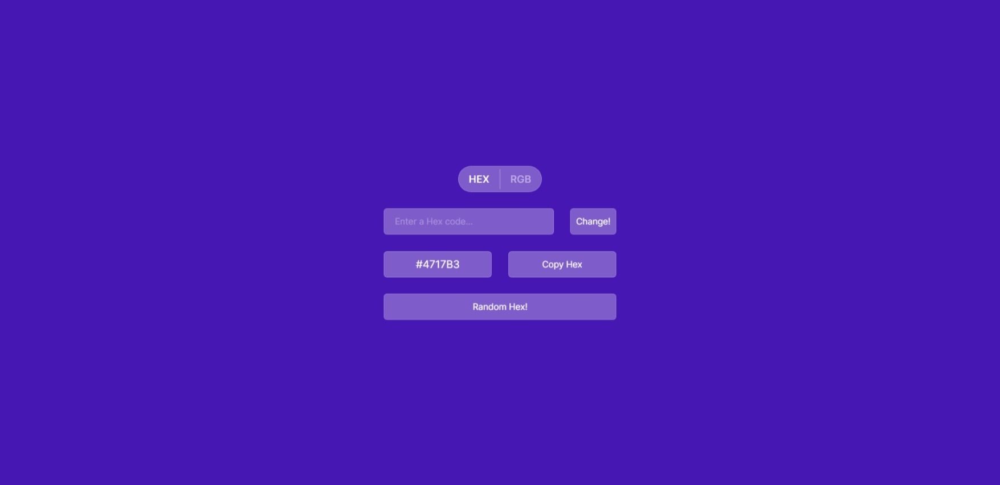
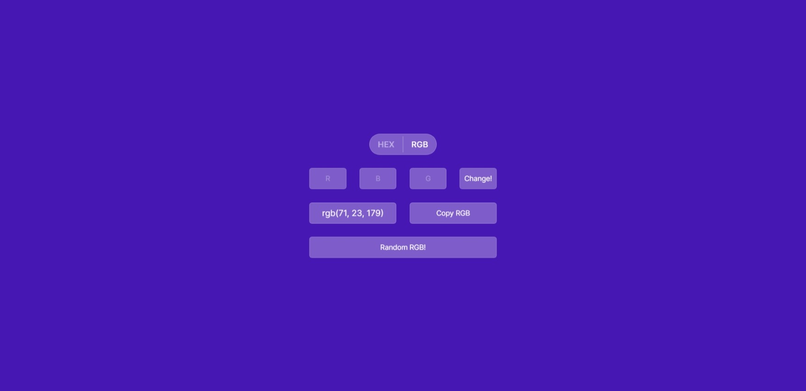

# color-generator-react

#### Hex Tab


#### RGB Tab


This application generates random hex and rgb color codes and converts user-entered color codes to real colors. It has been developed using React, Redux Toolkit, and Vite.

## Features

- Generate random hex color codes.
- Generate random rgb color codes.
- Convert user-entered hex color codes to real colors.
- Convert user-entered rgb color codes to real colors.
- Store hex codes in localStorage.
- Store rgb codes in localStorage.
- Manage application state using Redux Toolkit.

## Technologies Used

- React
- Redux Toolkit
- Vite

## Getting Started

To get started with this project, follow these steps:
```
git clone https://github.com/yusuftotic/color-generator-react.git
cd .\color-generator-react
npm install
npm run dev
```

## Future Features

Features we plan to add to the project in the future:

- Validator for HEX color code input.
- Validator for RGB color code input.
- History of previously used HEX codes with the ability to view the history.
- History of previously used RGB codes with the ability to view the history.
- User-friendly alerts and error messages.

## License

This project is licensed under the MIT License.